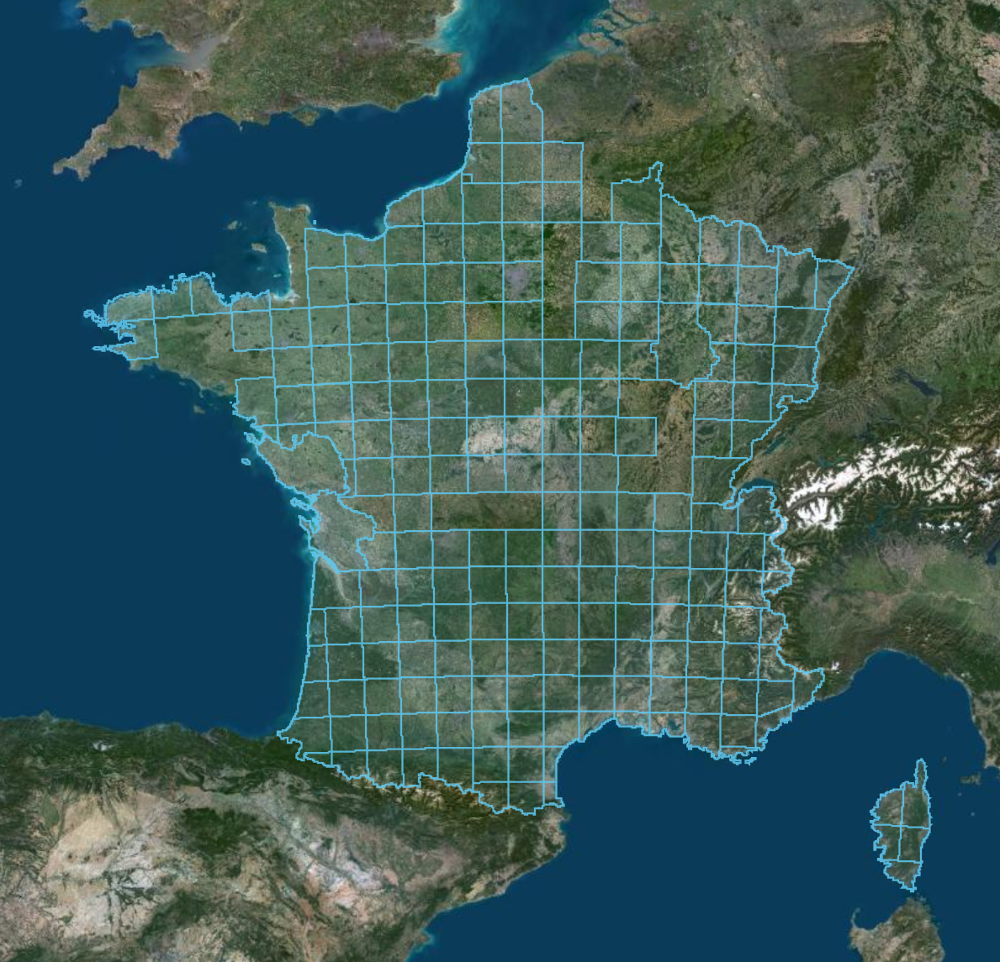

# Scopus


Explorer le **LiDAR HD de l'IGN** dans le navigateur, sans rien installer :
cabanes, ruines, sentiers, terrasses — tout ce que la végétation cache,
partout en France.

**Ouvrir `index.html` — c'est tout.** Ou essayer directement en ligne :
**[julesrumeau.github.io/Scopus](https://julesrumeau.github.io/Scopus/)**

> La détection automatique de structures existe dans le code mais reste
> masquée dans l'interface : elle n'a jamais été confrontée à une ruine
> réelle connue. L'outil sert aujourd'hui à *lire* le relief à l'œil — voir
> `CLAUDE.md`.

## Pourquoi entièrement statique

Aucun serveur, aucune base de données, aucun compte : le dépôt **est** le
site. `index.html` s'ouvre en double-cliquant depuis le disque exactement
comme il se publie sur GitHub Pages — le même fichier, sans rien changer.

Le nuage de points (jusqu'à 30 millions de points par dalle) est lu
directement depuis les serveurs de l'IGN par requêtes HTTP de plage, sans
jamais passer par un serveur intermédiaire. Tout le reste — décompression,
calcul du relief, détection — se fait dans l'onglet, sur la machine de qui
regarde.



## Utilisation

1. **Choisir une dalle** — cliquer une zone bleue sur la carte, ou chercher
   une commune ou des coordonnées (`42.74, 1.68`).
2. **Choisir la résolution, puis charger** — la dalle entière (1 km²), coût
   en Mo affiché avant tout téléchargement.
3. **Lire en 2D** — deux couches (photo aérienne, ombrage, micro-relief,
   Sky-View Factor, ouverture) de part et d'autre d'un rideau qu'on glisse.

Dans le nuage 3D, la navigation est celle d'une carte, pas d'un logiciel 3D :
glisser déplace, la molette zoome sous le curseur, Maj+glisser pivote.
Raccourcis `c` / `r` / `v` pour changer d'onglet, `f` pour tout cadrer.

## Lancer, tester, publier

```sh
npm test                  # tests unitaires et de sources, aucune dépendance
```

Publié sur GitHub Pages : chaque `git push` sur `main` redéploie tout seul.
Détail des réglages (`.nojekyll`, chemins relatifs) dans `CLAUDE.md`.

## En savoir plus

- **`CLAUDE.md`** — architecture complète, décisions techniques, pièges
  rencontrés, résultats de validation.
- **`TODO.md`** — ce qu'il reste à faire.

## Licences

Ce dépôt est sous licence **[MIT](LICENSE)**. Données **LiDAR HD © IGN**,
licence ouverte Etalab. Leaflet et laz-perf, redistribués dans `vendor/`,
gardent leurs licences respectives — détail dans
[`vendor/LICENCES.md`](vendor/LICENCES.md).

---

Un retour sur l'outil, un bug ? <jules.rumeau1@gmail.com>
