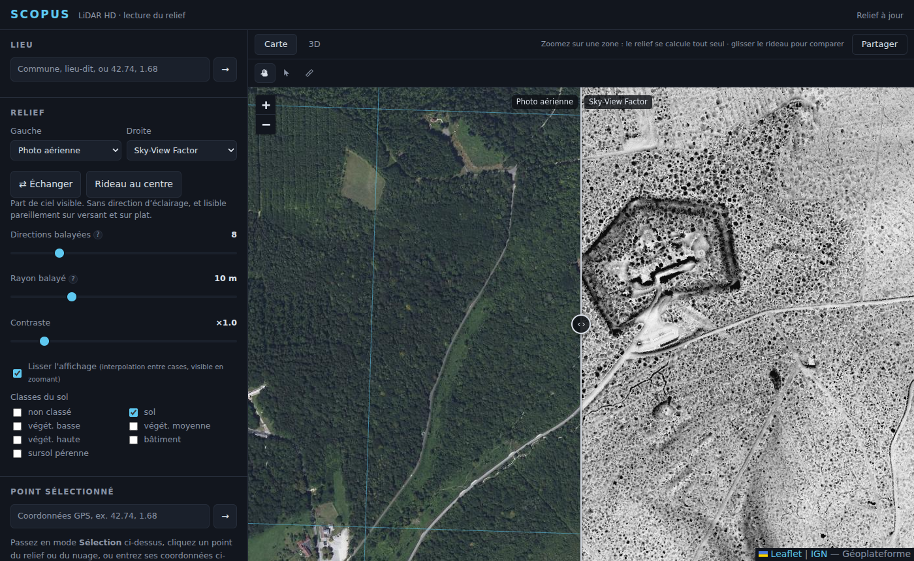
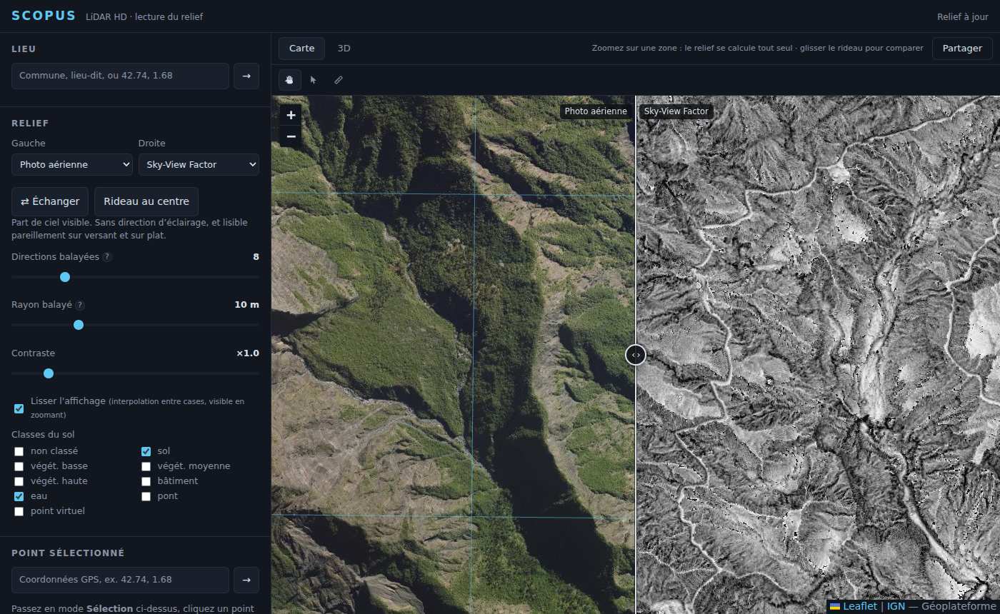

# Scopus



Explorer le **LiDAR HD de l'IGN** dans le navigateur, sans rien installer :
cabanes, ruines, sentiers, terrasses — tout ce que la végétation cache, en
métropole comme à la Réunion et en Guadeloupe.

**Ouvrir `index.html` — c'est tout.** Ou essayer directement en ligne :
**[julesrumeau.github.io/Scopus](https://julesrumeau.github.io/Scopus/)**

> Aucune détection automatique : l'outil calcule le relief, à vous de repérer
> ce qui vous intéresse, comme le fait la prospection LiDAR depuis toujours.
> Une détection existe dans le code, masquée tant qu'elle n'a pas été
> confrontée à des ruines réelles connues — voir `CLAUDE.md`.

## Utilisation

1. **Aller quelque part** — déplacer la carte, chercher une commune ou des
   coordonnées (`42.74, 1.68`), ou ouvrir un lien partagé.
2. **Zoomer** — le relief de ce qui est à l'écran se calcule tout seul, sans
   dalle à choisir ni rien à lancer : les points arrivent du plus grossier au
   plus fin, et l'image s'affine à mesure.
3. **Comparer** — un rideau sépare deux côtés : photo aérienne, plan IGN,
   ombrage, ombrage coloré, micro-relief, Sky-View Factor, ouvertures positive
   et négative. On le glisse pour voir ce que la photo ne montre pas.

Sur la carte, sélectionner un point donne son altitude, et la mesure en chaîne
donne distances et dénivelés. L'onglet **3D** montre en nuage de points ce que
la carte affichait ; la navigation y est celle d'une carte : glisser déplace,
la molette zoome sous le curseur, Maj+glisser pivote.

**Partager** copie le lien de la vue, au format d'OpenStreetMap
(`#map=zoom/lat/lon`) : il s'ouvre tel quel dans osm.org, iD ou JOSM.

Sur téléphone, le panneau devient une feuille tirée du bas, et la carte reste
utilisable au-dessus.



## Pourquoi entièrement statique

Aucun serveur, aucune base de données, aucun compte : le dépôt **est** le
site. `index.html` s'ouvre en double-cliquant depuis le disque exactement
comme il se publie sur GitHub Pages — le même fichier, sans rien changer.

Les points sont lus directement sur les serveurs de l'IGN par requêtes HTTP
de plage — seuls les blocs de la vue, et seulement les parties utiles de
chacun —, sans jamais passer par un serveur intermédiaire, puis gardés dans
le cache du navigateur pour la visite suivante. Tout le reste — décompression,
calcul du relief — se fait dans l'onglet, sur la machine de qui regarde.

## Lancer, tester, publier

```sh
npm test                  # tests unitaires et de sources, aucune dépendance
```

Publié sur GitHub Pages : chaque `git push` sur `main` redéploie tout seul.
L'ancienne interface, par dalle d'1 km² à charger d'un bloc, reste accessible
en ajoutant `?dalle` à l'adresse.

## En savoir plus

- **`CLAUDE.md`** — architecture complète, décisions techniques, pièges
  rencontrés, mesures.
- **`TODO.md`** — ce qu'il reste à faire.

## Licences

Ce dépôt est sous licence **[MIT](LICENSE)**. Données **LiDAR HD © IGN**,
licence ouverte Etalab. Leaflet et laz-perf, redistribués dans `vendor/`,
gardent leurs licences respectives — détail dans
[`vendor/LICENCES.md`](vendor/LICENCES.md).

---

Un retour sur l'outil, un bug ? <jules.rumeau1@gmail.com>
