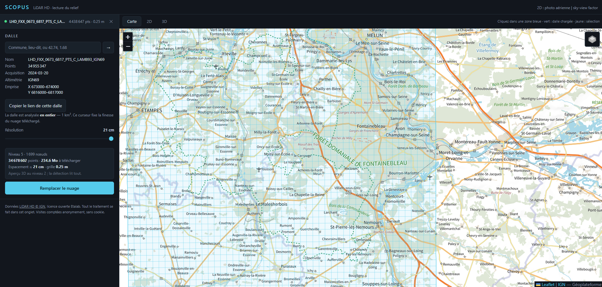
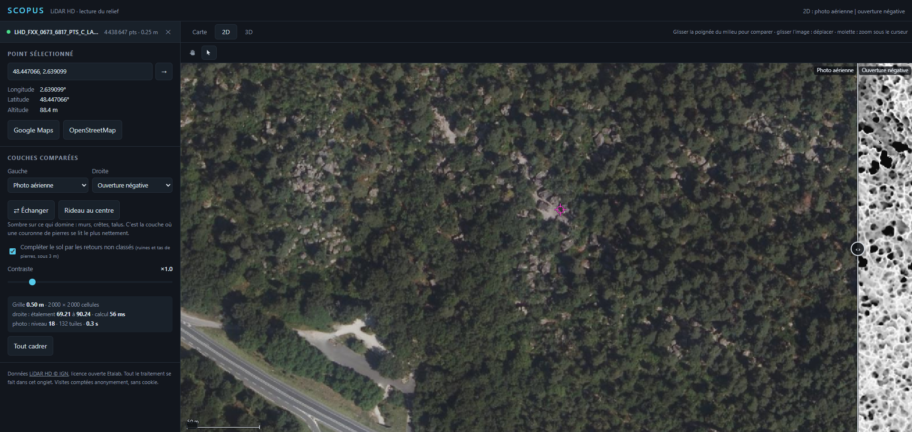
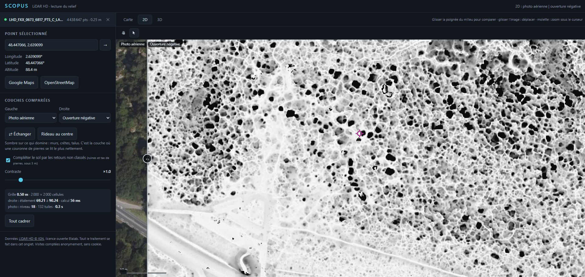
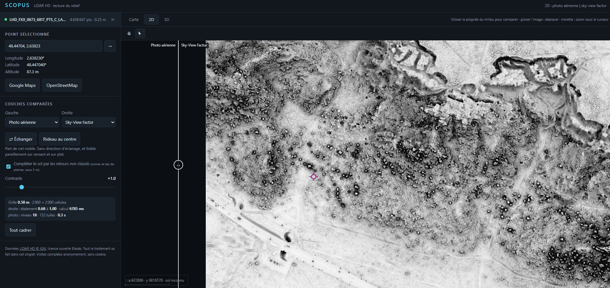

# Fontainebleau : voir les blocs sous les arbres

La forêt de Fontainebleau est un exemple parfait pour montrer ce que fait le
LiDAR HD : des milliers de blocs de grès, invisibles ou à peine visibles sur
la photo aérienne à cause des arbres, apparaissent nettement une fois le
relief calculé — avec les couches « ouverture négative » et « Sky-View
Factor ».

Dalle testée : `LHD_FXX_0673_6817` (secteur du Bas Cuvier), photographiée
par l'IGN le 20 mars 2024, 35 millions de points. Point de repère : le bloc
de La Marie-Rose —
48.447066°N, 2.639099°E.

## Couverture

La limite de ce qui est couvert par le LiDAR HD passe tout près du bord est
de la forêt — mais la forêt dans son ensemble, Bas Cuvier compris, est bien
couverte.

## Photo aérienne vs relief calculé

À gauche la photo aérienne, à droite un aperçu du relief calculé — sur la
photo, cet endroit n'est qu'une forêt.

Rideau glissé côté relief : chaque tache sombre est un bloc ou une paroi de
rocher.

## Sky-View Factor

Une autre couche, une autre façon de voir : la part de ciel visible depuis
chaque point du sol. Ça se lit aussi bien sur du plat que sur une pente,
sans dépendre du sens de la lumière.

## Le nuage de points en 3D

En 3D, chaque bloc n'est souvent fait que de **quelques points**, pas d'une
forme pleine — normal vu la précision du LiDAR à cette échelle, mais ça peut
rendre un bloc difficile à repérer sur une image figée. Ça se voit
beaucoup mieux en bougeant la caméra, d'où le GIF plutôt qu'une capture
fixe.

Autre chose à savoir : certains blocs n'ont **aucun point du tout** à
l'endroit où ils sont. Ce n'est pas une erreur — c'est un trou, une absence
de points, et ce trou peut lui-même être le signe qu'il y a un bloc à cet
endroit plutôt que du vide.

## Ce qu'il faut savoir avant de faire confiance à l'image

- **Le LiDAR ne voit pas partout pareil.** Le laser doit traverser les
  feuilles et les branches pour toucher le sol — là où c'est dense, moins de
  points arrivent au sol qu'en terrain dégagé. Un bloc peut donc apparaître
  flou ou incomplet sans que ce soit un défaut de l'outil.
- **Un bloc, c'est parfois peu de points, parfois pas de points du tout.**
  Voir la section « Le nuage de points en 3D » ci-dessus.
- **Ce n'est pas une détection automatique de blocs.** Ce sont des images de
  relief classiques (ouverture, Sky-View Factor), les mêmes qui servent
  ailleurs à repérer une ruine ou un sentier. Elles montrent le terrain
  tel qu'il est, sans rien trier pour vous.

C'est un premier essai sur cette forêt, pas un résultat final — à affiner
avec des retours sur d'autres secteurs.
